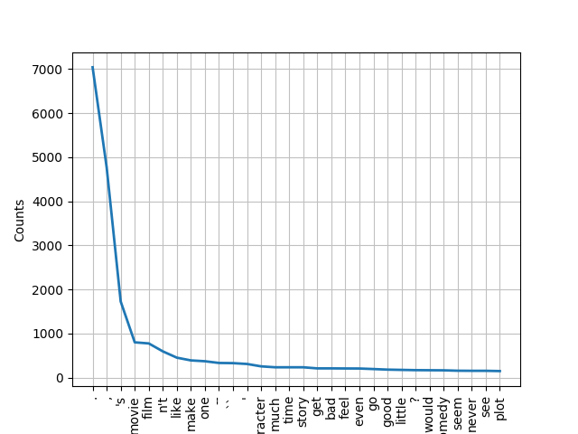
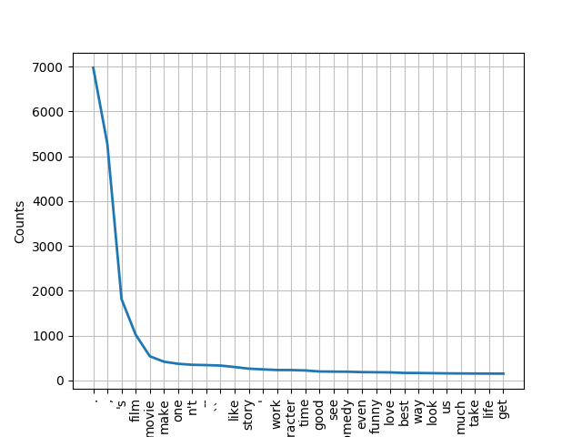

# homework

**1. Describe text processing pipeline you have selected.**
<<<<<<< HEAD
- Statistical anlysis to determine the most used words, least used were also determined, but there are 6000 words aprox. with a 1 frequency. See the following figures for most used words:
=======
- Data preprocessing will follow the basic pipeline:

  

- Other methods have been included into the Export class, but no better results were obtained. Lemmatization appears to be working better than stemming, as expected. For more information, see the plots below: (they were obtained with a frequency distribution method located inside the Export class):
>>>>>>> 96529e24f2f5491d402dd1c5ee5c2a549e61f9d5

  
  
 frequency distribution of words for negative reviews (categories obtained by lemmatization)

  
  
 frequency distribution of words for positive reviews (categories obtained by lemmatization)

<<<<<<< HEAD
- The text processing pipeline, is the same for both algorithms (except the extra use of a tokenizer before the execution of NB) : 

	1. Remove punctuation: With the information about the most used punctuation elements in the text, those are filtered.

	2. Remove the least used words: Those words that are used less than 6 times in the whole text are marked and removed.

	3. Remove the Stopwords: A personalized file is used in order to remove the Stopwords.
	4. Lemmatization: Obtain the lemmas for every of the final words.
=======
- The other two methods, which have not been shown yet are: 
   1. create_df: It creates a pandas dataframe from a list (it will useful for the classifier)
   2. tokenize_sentence: It obtains all the sentences in a list with multiple lines (not used yet)
   3. print: prints all lines of a list (used to check and debug)
>>>>>>> 96529e24f2f5491d402dd1c5ee5c2a549e61f9d5

**2. Why you have selected these two classification methods?**

Naive bayes (NB) was chosen due to its popularity in the field after reading some papers and documentation, I realized it was fast and quite accurate. It also outperformed several of the other algorithms I tried and it was easy to tune.
On the other hand the chosen CNN, might seem more time consuming, but thanks to the used of an  embedding layer and well adjusted hyperparameters through random search, it ends outperforming most of the other options. Finally, at first glance, the main reason to go with it was, undoubtedly, its flexibility and adaptability to any problem (if well adjusted).

**3. Compare selected classification methods. Which one is better? Why?**

Both classifiers perform almost the same (86,47% CNN, 86,66% NB), I guess, even if CNN is really flexible it is a tough classifier to tune and perhaps with a different layer distribution or more hyperparameters (in the choosing dictionary), it could clearly 	outperform the NB. On the other hand, NB is, as seen in lots of papers, the most popular option in document analysis, as it can obtain good results in a decent time while being easy to adjust. 
To sum it up, the NB is better, due to its fine tunning of hyperparameters and normally good 	performance in this field.

**4. How would you compare selected classification methods if the dataset was imbalanced?**

In the case of an imbalanced dataset, a popular solution (the one I would choose) is to 	balance it artificially, do an statistical analysis of the frequency of all the words in both 	datasets and eliminate the least used ones by setting a threshold that would remove more words in a dataset, so that balance is achieved.
