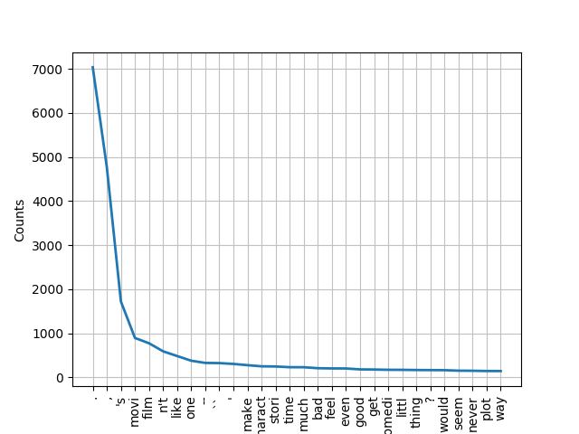

# homework

**1. Describe text processing pipeline you have selected.**
- Data preprocessing will follow the basic pipeline:

  

- Other methods have been included into the Export class, but no better results were obtained. Lemmatization appears to be working better than stemming, as expected. For more information, see the plots below: (they were obtained with a frequency distribution method located inside the Export class):

  
  
 frequency distribution of words for negative reviews (categories obtained by lemmatization)

  
  
 frequency distribution of words for negative reviews (categories obtained by stemming)

- The other two methods, which have not been shown yet are: 
   1. create_df: It creates a pandas dataframe from a list (it will useful for the classifier)
   2. tokenize_sentence: It obtains all the sentences in a list with multiple lines (not used yet)
   3. print: prints all lines of a list (used to check and debug)

**2. Why you have selected these two classification methods?**

**3. Compare selected classification methods. Which one is better? Why?**

**4. How would you compare selected classification methods if the dataset was imbalanced?**
