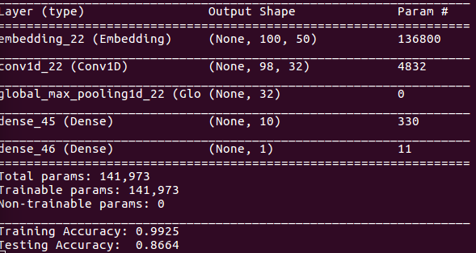
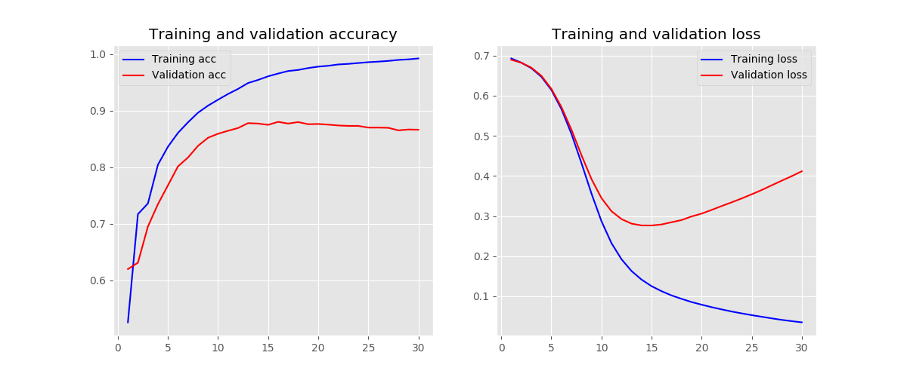

# homework
Run with python 3.5, read or execute requirements.txt first

**1. Describe text processing pipeline you have selected.**
- Statistical anlysis to determine the most used words, least used were also determined, but there are 6000 words aprox. with a 1 frequency. See the following figures for most used words:

  
  
 frequency distribution of words for negative reviews (categories obtained by lemmatization)

  
  
 frequency distribution of words for positive reviews (categories obtained by lemmatization)

- The text processing pipeline, is the same for both algorithms) : 

	1. __*Remove punctuation:*__ With the information about the most used punctuation elements in the text, those are filtered.

	2. __*Remove the least used words:*__ Those words that are used less than 6 times in the whole text are marked and removed.

	3. __*Remove the Stopwords:*__ A personalized file is used in order to remove the Stopwords.
	4. __*Lemmatization:*__ Obtain the lemmas for every of the final words.
	5. __*Tokenize lemmas for each classifier:*__ Each classifier uses its own tokenizer.

**2. Why you have selected these two classification methods?**

Multinomial naive bayes (NB) was chosen due to its popularity in the field after reading some papers and documentation, I realized it was fast and quite accurate. It also outperformed several of the other algorithms I tried and it was easy to tune.
On the other hand the chosen CNN, might seem more time consuming, but thanks to the used of an  embedding layer and well adjusted hyperparameters through random search, it ends outperforming most of the other options. Finally, at first glance, the main reason to go with it was, undoubtedly, its flexibility and adaptability to any problem (if well adjusted).

**3. Compare selected classification methods. Which one is better? Why?**

Both classifiers perform almost the same (86,64% CNN, 87,00% NB), I guess, even if CNN is really flexible it is a tough classifier to tune and perhaps with a different layer distribution or more hyperparameters (in the choosing dictionary), it could clearly outperform the NB. On the other hand, NB is, as seen in lots of papers, the most popular option in document analysis, as it can obtain good results in a decent time while being easy to adjust. 
To sum it up, the NB is better, due to its fine tunning of hyperparameters and normally good performance in this field.

**4. How would you compare selected classification methods if the dataset was imbalanced?**

In the case of an imbalanced dataset, a popular solution (the one I would choose) is to balance it artificially, do an statistical analysis of the frequency of all the words in both 	datasets and eliminate the least used ones by setting a threshold that would remove more words in a dataset, so that balance is achieved.

**Results from execution**

Gathered pictures from the shell or plots, which summarize the obtained results for both classifiers:

1. NB (multinomial Naive Bayes)

  
  
 Multinomial NB accuracy accuracy from shell

2. CNN (Convolutional Neural Network)

  
  
 CNN accuracy and structure from shell

  
  
 CNN training evolution plot)

**Summary of results for all the tested classifiers**

| Classifier                   | Test accuracy (%) |
| ---------------------------- | ------------------|
| multinomial NB               | 87.00             |
| CNN                          | 86.64             |
| SVM (suport vector machines) | 85.45             |  
| NN                           | 84.73             |
| logistic regression          | 83.12             |
   

